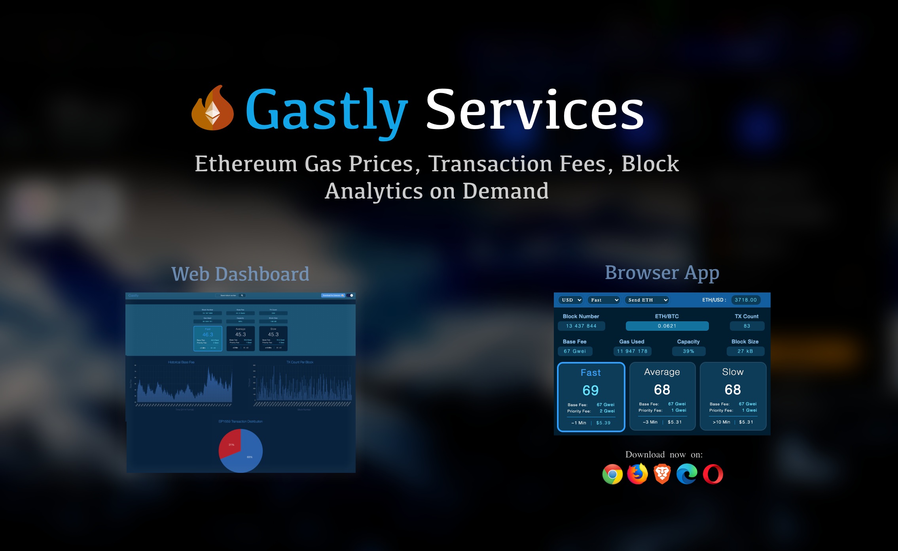

<h1>Hi 👋, I'm Mark Odayan</h1>
 

  
  
  

### :man_technologist: &nbsp;About Me:

I am a Software Engineer from South Africa 🇿🇦, orginally from a Mechatronics Engineering background. I enjoy learning about computer science, mathematics, systems engineering, and building products and solutions. Welcome to my GitHub 😊.

- 💻 <b>Full-Stack Developer</b>: I have experience building web, mobile and browser applications and various types of backend services.
- 🛠 <b>DevOps Practitioner</b>: I have experience with deploying applications/services on virtual machines, managed app engines and setting up reliable CI/CD pipelines.
- 🤓 <b>Research Interests</b>: computational and complexity theory, mathematics, distributed systems, protocol engineering and cryptography.
- 🧪 <b>Building Interests</b>: I am currently working towards building tooling and services within the Ethereum ecosystem.

 

---

### 💡 My Projects:
[Gastly](https://gastly.tools) is a live service I have made to deliver real-time gas prices and fee information about the Ethereum network. There are currently 2 types of clients available: i) Browser Extension Client (available on Chromium and Firefox browsers), ii) Web Client [gastly.tools](https://gastly.tools) 

&nbsp;

- Gastly has received funding via quadratic funding initiatives set up by [Gitcoin](https://gitcoin.co/grants/3562/gastly-gas-price-chrome-extension).
- A knowledge base is currently being worked on to educate newcomers to concepts about Ethereum transactions and how congestion management works in a permissionless network (concepts around algorithmic guarantees of 'social optimality').

---

### 🛠 &nbsp;Languages and Tools:

&nbsp;
&nbsp;
&nbsp;

  
&nbsp;
&nbsp;
 

 
  
  
&nbsp;
  
  
&nbsp;
&nbsp;
&nbsp;
  &nbsp;
&nbsp;

  
&nbsp;
  

---

&nbsp;

