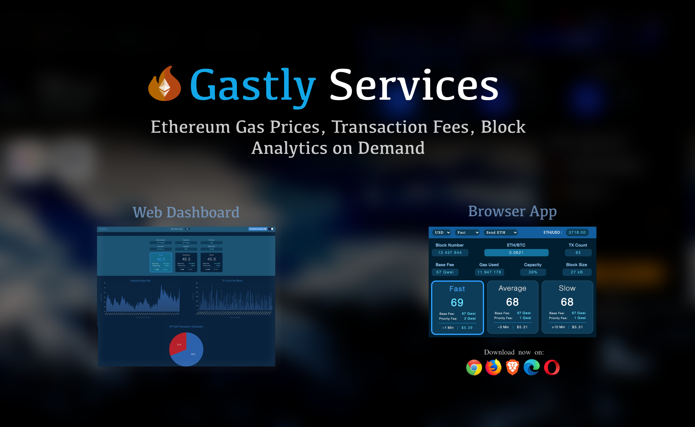

<h1>Hi 👋, I'm Mark Odayan</h1>
 

  

 

  
  
  
  

### :man_technologist: &nbsp;About Me:

I am a software developer from South Africa 🇿🇦 from a mechatronics engineering background. My areas of interest include distributed systems, systems engineering and computing. Welcome to my GitHub 😊.

- 💻 <b>Full-Stack Development</b>: Experienced with building products and services. Whether its client-side development, backend development or anywhere requiring an understanding of how sub-components of a system need to sync with one another in the global context of the entire product, I understand software lifecycles and how to approach managing any dynamic system.  
- 🛠 <b>System Design, Deployment and Monitoring</b>: Experienced with deploying real systems with various moving parts on dedicated servers and managing production environments. I Prioritise implementing and managing productive CI/CD pipelines to guarantee reliable and observable system upgrade transitions. I use monitoring and observability to its best effects to learn system health and establish reference points to measure how changes in inputs or system implementation details influence system properties and guarantees.
- 🤓 <b>Research Interests</b>: My core interests lie with distributed systems design, information theory, cryptography and applied number theory, systems engineering, and mechanism design in computer networks.

 

---

### 💡 My Projects:
<a href='https://chromewebstore.google.com/detail/gastly/oajdjjcjlllhmklicblbjfmfkekeldfa?authuser=0&hl=en' target='_blank'>Gastly</a> is a live service that serves users through a browser application. It works in the background and provides users with real-time transaction fee information for doing popular actions on Ethereum. Having knowledge of how Ethereum works, I have abstracted much of the complexity of dealing with a blockchain and provide users with simplified and real-time processed information to inform them how much doing certain things on-chain will cost and denominated in currencies they understand. Want to deposit capital into a money market protocol to put your assets to work? At the click of a button, you can see what sending that transaction would cost in equivalent dollars (or whatever currency you are familiar with) 

&nbsp;

- Gastly has received funding via quadratic funding initiatives set up by [Gitcoin](https://gitcoin.co)
- Service has been live since 2021 and has undergone 2 major version releases (to V1 from V0, to V2 from V1) which include their own collection of minor releases. With March 2026 being where the transition between V1 and V2 happened which involved complete server-side and client re-writes to prepare Gastly for major updates during 2026.

---

### ✍🏾 Published Technical Writing

**[⚙️ The Practical Guide to Rollups
](https://odayan.substack.com/p/the-practical-guide-to-rollups)**   *An in-depth technical look at the fundamental design and structure of Ethereum rollups to guide engineering and analysis*

**[⚙️ EIP-1559: Separating Mechanisms From Memes
](https://odayan.substack.com/p/eip-1559-separating-mechanisms-from)**   *A technical and economic analysis of EIP-1559 and transaction fee mechanism design in Ethereum (Reviewed by Vitalik Buterin, as well as researchers from the Ethereum Foundation, Offchain Labs, L2Beat)*

**[⚙️ Resource Pricing and TFM Design in Ethereum (Part 1 - Blockchain Resources)
](https://odayan.substack.com/p/resource-pricing-and-tfms-part-1)**   *A technical article that dives into computational and economic modelling of the Ethereum network, exploring how resources are priced, measured and allocated in its decentralised network setting*

**[⚙️ A Comprehensive Guide to RLP Encoding in Ethereum
](https://medium.com/@markodayansa/a-comprehensive-guide-to-rlp-encoding-in-ethereum-6bd75c126de0)**   *A blog post diving into data serialisation methods utilised by Ethereum execution clients with verbose examples*

 

---

### 🛠 &nbsp;Languages and Tools:

Programming Languages

  &nbsp;
  &nbsp;
  &nbsp;

  
  

Frameworks/DBs/Technologies

  &nbsp;
  &nbsp;
  &nbsp;
  
  
  
  
   

Cloud Platforms Experience

  &nbsp;
  &nbsp;
  &nbsp;
    &nbsp;
  &nbsp;

  

Other Development Tools

  &nbsp;
  

  
  

UI Design/Prototyping

  &nbsp;
  &nbsp;

---

<!-- 
&nbsp;
 -->
